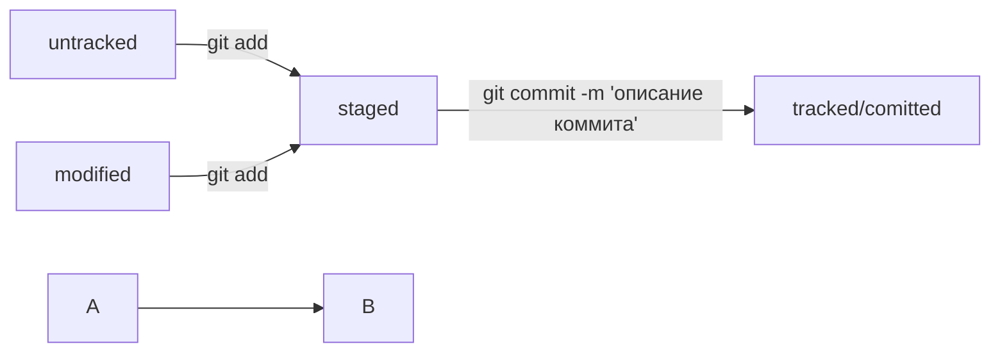

Репозитарий для тренировки с git.

Краткая шпрагалка по git и GitHub   

git - это система контроля версий. Разработал и создал Линус Торвальдс, создатель "Линукс".  
GitHub - это популярный удаленный репозитарий, к котором храниться большое количество проектов в IT. Принадлежит компании "Майкрософт".  

1. Начнем с GitHub  https://github.com

GitHub — сервис онлайн-хостинга репозиториев, обладающий всеми функциями распределённого контроля версий и функциональностью управления 
исходным кодом — всё, что поддерживает Git и даже больше. Также GitHub может похвастаться контролем доступа, багтрекингом, управлением 
задачами и вики для каждого проекта.  (источник - https://tproger.ru/translations/difference-between-git-and-github)

Сделать свой репозиторий на GitHub можно on-line, ссылка https://github.com. Для этого нужно пройти процедуру регистрации, создать логин, 
определить пароль и далее в совем аккаунте на GitHub можно создавать отдельные репозитории по определенным темам или направления, или в той 
логике, как считает владедец аккаунта. Загружать файлы в репозитории можно также online.    

В самом упрощеном случае, если репозиторий использует только владелец и не нужен контроль версий, то можно просто добавлять файлы (проекты) 
в репозиторий и если есть необходимость делиться ими. Т.е. по сути это будет облачное хранилище. Ограничения по хранению: 
на размер одно файла - 100Mb (рекоменуется до 50 Mb), на 1 репозиторий - 5Gb (рекоменуется 1 Gb)   

Для организации контроля версий, соединения с локальным репозиторием, совместной работы над файлами (проектами) нужно использовать git.  

Конкретное пояснение как работать с GitHub можно посмотреть по ссылке   
https://skillbox.ru/media/code/chto-takoe-github-i-kak-im-polzovatsya/

2. git - система контроля версий   

Терминология (источник - https://githowto.com/ru/git_basics)   

**Репозиторий**  
Репозиторий Git — это хранилище, в котором расположен ваш проект и его история. Это может быть локальное хранилище где-то на вашем 
компьютере или удаленное хранилище на сервисе типа GitHub или другом хостинге в Интернете. Репозиторий служит для отслеживания изменений 
в проекте, координации работы между несколькими людьми и отслеживания истории проекта.    

Скажем, у вас на компьютере есть директория со всеми файлами вашего проекта. Когда вы инициализируете репозиторий Git в этой директории, 
Git создает скрытую поддиректорию под названием .git, в которой хранится вся информация о репозитории. Эта информация включает историю 
всех изменений, внесенных в репозиторий, а также его текущее состояние.    

**Коммит**   
Вы можете думать о коммите как о снимке вашего проекта в определенный момент времени. Правда, коммит содержит только информацию об изменениях, которые были внесены в репозиторий с момента последнего коммита. Он не содержит все файлы репозитория (если только это не первый коммит). Таким образом, каждый коммит — это небольшой кусочек истории репозитория, основанный на предыдущем коммите. Все они связаны между собой в цепочку, формируя историю изменений вашего проекта.

**Ветка**   
Ветка — это параллельная версия репозитория. Ветки позволяют вам работать над отдельными функциями вашего проекта, не влияя на 
основную версию. Закончив работу над новой фичей, вы можете объединить эту ветку с основной версией проекта.   

Установить git (источники)  
https://git-scm.com/downloads   
https://gitforwindows.org   

Конкретное пояснение как работать с git можно посмотреть по ссылке
https://skillbox.ru/media/code/chto_takoe_git_obyasnyaem_na_skhemakh/?utm_source=media&utm_medium=link&utm_campaign=all_all_media_links_links_articles_all_all_skillbox
   
Хороший гайд: кратко теория + практический тренажер  
https://githowto.com/ru   

Шпаргалка по основным командам git  
https://github.com/cyberspacedk/Git-commands

Статья на Хабр "30 основных команд git"
https://habr.com/ru/companies/ruvds/articles/599929/

Добавил схему по статусам файлов в git через mermaid

